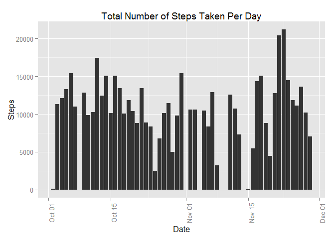
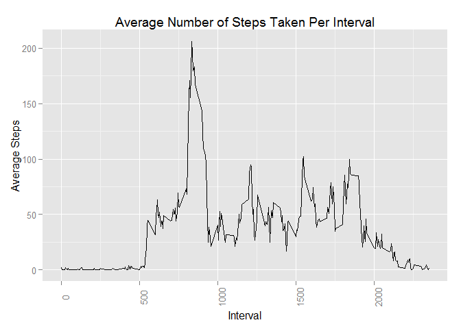
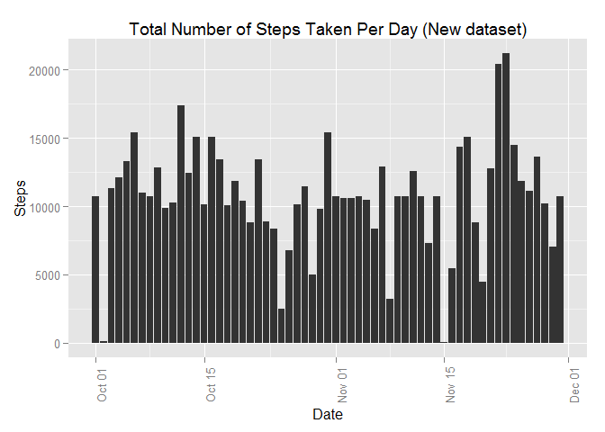
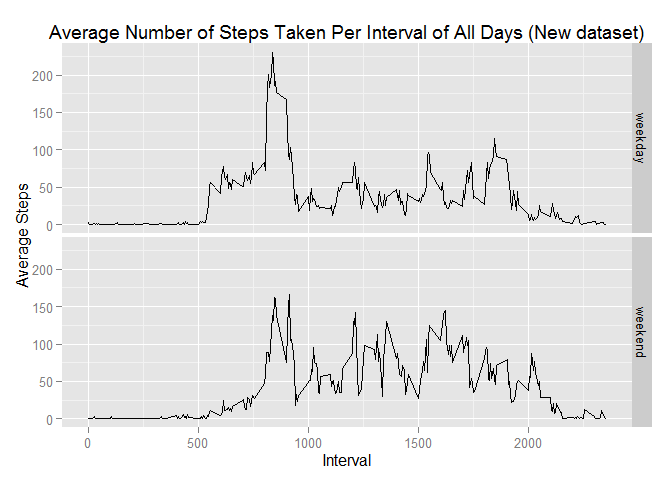

# Reproducible Research: Peer Assessment 1


The data consists of two months of data from an anonymous individual collected during the months of October and November, 2012 and include the number of steps taken in 5 minute intervals each day.


## Loading and preprocessing the data

Load data from downloaded .zip file and preprocess the data for sbsequent analysis.


```r
#install.packages("lubridate")
library(lubridate)
zipfile <- "activity.zip"
csvfile <- "activity.csv"
unzip(zipfile, files = c(csvfile))
steps_raw        <- read.csv(csvfile)
steps_clean      <- steps_raw[!is.na(steps_raw$steps), ]
steps_clean$date <- ymd(steps_clean$date)
```


## What is mean total number of steps taken per day?

Calculate the total number of steps taken per day.


```r
steps_clean_sum <- aggregate(steps ~ date, steps_clean, sum)
```

Make a histogram of the total number of steps taken each day.


```r
#install.packages("ggplot2")
library(ggplot2)
qplot(date, steps, 
      data = steps_clean_sum, 
      geom = "histogram", 
      stat = "identity", 
      main = "Total Number of Steps Taken Per Day",
      xlab = "Date",
      ylab = "Steps"
      ) + theme(axis.text.x = element_text(angle = 90))
```

 

Calculate and report the mean and median of the total number of steps taken per day


```r
mean_steps_clean_sum   <- mean(steps_clean_sum$steps)
median_steps_clean_sum <- median(steps_clean_sum$steps)
```

The mean is **10766.19** and the median is **10765**.


## What is the average daily activity pattern?

Make a time series plot of the 5-minute interval (x-axis) and the average number of steps taken, averaged across all days (y-axis)


```r
#install.packages("ggplot2")
library(ggplot2)
steps_clean_mean <- aggregate(steps ~ interval, steps_clean, mean)
qplot(interval, steps,
      data = steps_clean_mean, 
      geom = "line", 
      stat = "identity", 
      main = "Average Number of Steps Taken Per Interval",
      xlab = "Interval",
      ylab = "Average Steps"
      ) + theme(axis.text.x = element_text(angle = 90))
```

 

Discover the 5-minute interval, on average across all the days in the dataset, that contains the maximum number of steps.


```r
steps_clean_mean_max <- steps_clean_mean[which.max(steps_clean_mean$steps),]
```

Interval **835** contains the maximum average number of steps (**206.1698113**).


## Inputing missing values

Calculate and report the total number of missing values in the dataset (i.e. the total number of rows with NAs)

```r
count_missing <- sum(is.na(steps_raw$steps))
```

There are **2304** missing values in the dataset.

To create a new dataset that is equal to the original dataset but with the missing data filled in, the strategy is to fill in the missing values with the mean value of the associated interval. 


```r
steps_missing           <- steps_raw[is.na(steps_raw$steps),]
steps_missing$date      <- ymd(steps_missing$date)
steps_missing           <- merge(steps_missing, steps_clean_mean, by = "interval")
steps_missing           <- steps_missing[, c("steps.y","date","interval")]
colnames(steps_missing) <- c("steps", "date", "interval")
steps_merged            <- rbind(steps_clean, steps_missing)
```

Make a histogram of the total number of steps taken each day with the new dataset.


```r
#install.packages("ggplot2")
library(ggplot2)
steps_merged_sum <- aggregate(steps ~ date, steps_merged, sum)
qplot(date, steps, 
      data = steps_merged_sum, 
      geom = "histogram", 
      stat = "identity", 
      main = "Total Number of Steps Taken Per Day (New dataset)",
      xlab = "Date",
      ylab = "Steps"
      ) + theme(axis.text.x = element_text(angle = 90))
```

 

Calculate and report the mean and median of the total number of steps taken per day of the new dataset.


```r
mean_steps_merged_sum   <- mean(steps_merged_sum$steps)
median_steps_merged_sum <- median(steps_merged_sum$steps)
```

For the new dataset, the mean is **10766.19** and the median is **10766.19**.

The following tabe compares the mean and median between the clean dataset and the new dataset along with a comment of difference if any.

Value  | Clean dataset | New dataset | Comment
------ | ------------- | ----------- | ------- 
Mean   | **10766.19**   | **10766.19**   | No difference.
Median | **10765** | **10766.19** | The addition of the **2304** missing values skewed the median to the mean.


## Are there differences in activity patterns between weekdays and weekends?

Create a new variable to represent weekday and weekends.

```r
steps_merged$day <- as.factor(
  ifelse(weekdays(steps_merged$date) %in% c("Sunday", "Saturday"), 
         "weekend", 
         "weekday"
         )
  )
```

Make a panel plot containing a time series plot of the 5-minute interval and the average number of steps taken, averaged across all weekday days or weekend days. 


```r
#install.packages("ggplot2")
library(ggplot2)
steps_merged_mean <- aggregate(steps ~ interval + day, steps_merged, mean)
qplot(interval, steps,
      data   = steps_merged_mean,
      facets = day ~ .,
      geom = "line", 
      stat = "identity", 
      main = "Average Number of Steps Taken Per Interval of All Days (New dataset)",
      xlab = "Interval",
      ylab = "Average Steps"
)
```

 

From the plot, we can see that

1. The average number of steps taken per interval increases more earlier in the day (between intervals 500 and 750) for weekdays than weekends suggesting that activities start earlier on weekdays.
2. The maximum average number of steps taken per interval is higher for weekdays than weekends (between intervals 750 and 1000) suggesting that activities on weekdays are more intensive.
3. The average number of steps taken per interval drops below 50 by interval 2000 for weekdays while there is a slight peak above 75 after interval 2000 on weekends suggesting that activities end later on weekends.
